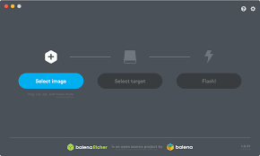

Install Raspian
=====================

   Clearing the PyBadge and loading the CircuitPython UF2 file

Before doing anything else, you should format your sd card and install the latest version of Raspian onto it. This ensures you have a clean build with all the latest updates and no leftover files floating around. Rasberry has an excellent quick start guide `here <https://www.raspberrypi.org/documentation/installation/installing-images/>`_ to step you through the process of getting the latest version of raspian onto your pi.

Just a reminder, if you are having any problems loading Raspian onto your Pi, ensure that you are using the right programs and a functional micro sd card. Once the Raspian is all loaded, come on back to continue the tutorial.
